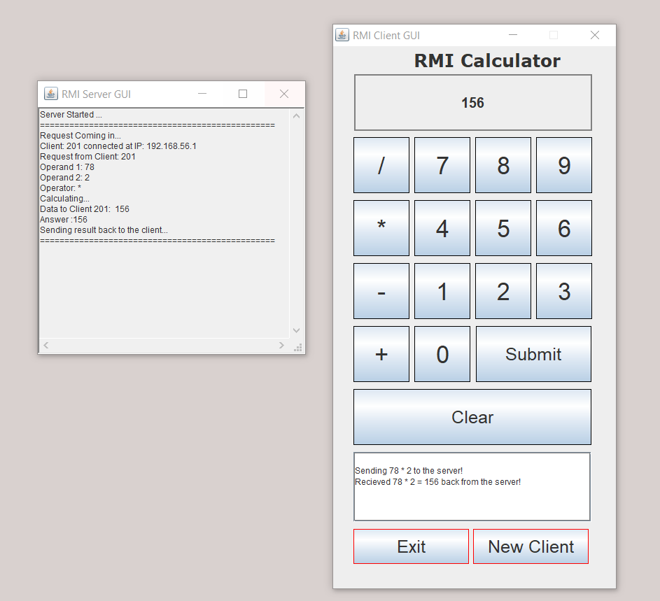

# Multithreaded RMI Client Server Calculator App - Java, Swing, RMI 

## Client

* Run multiple clients with unique identifiers to send and receive requests from a server with interface using RMI through a calculator.

## Server

* Handles all requests from the clients, calculations etc ...

## Tech used

* Java
* RMI
* SWING/AWT

